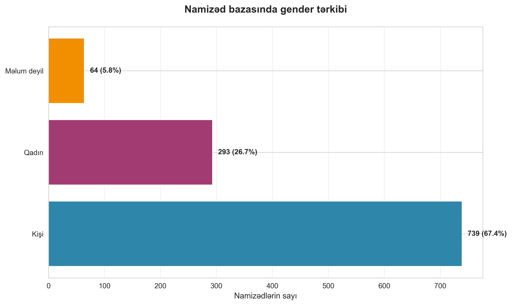
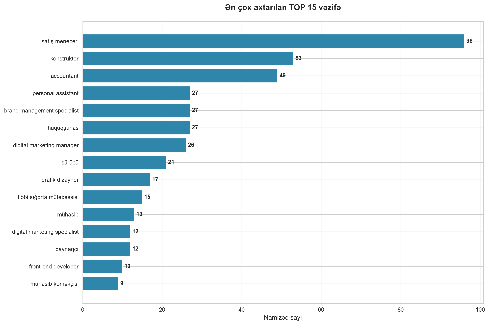
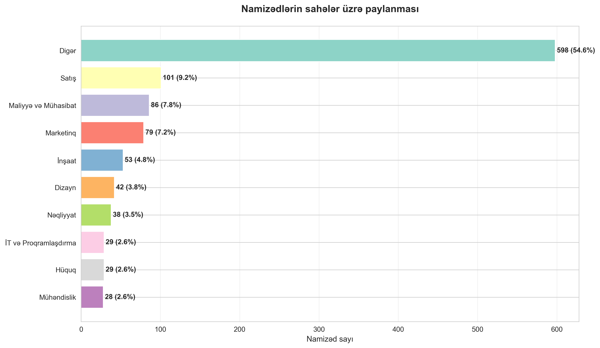
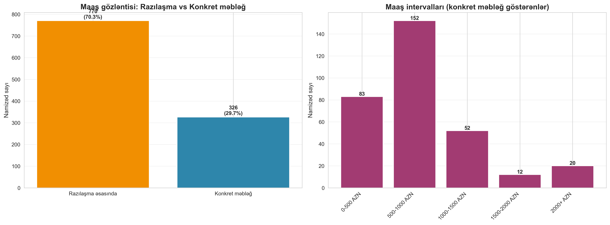
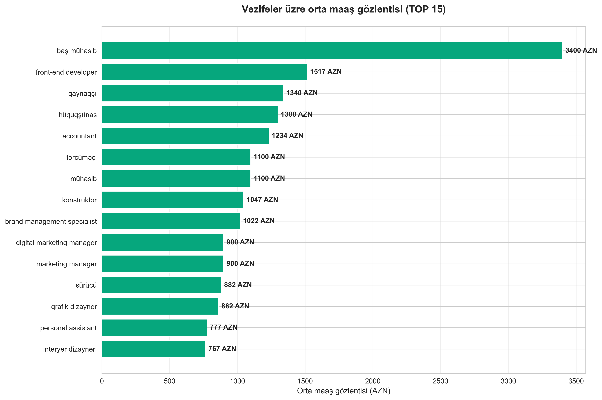
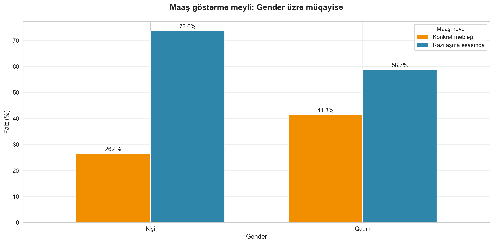
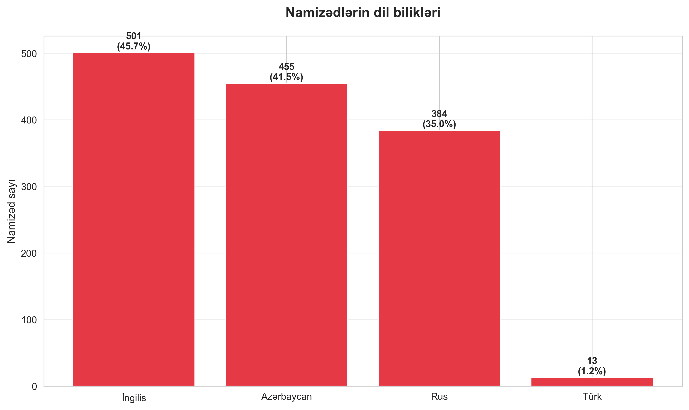
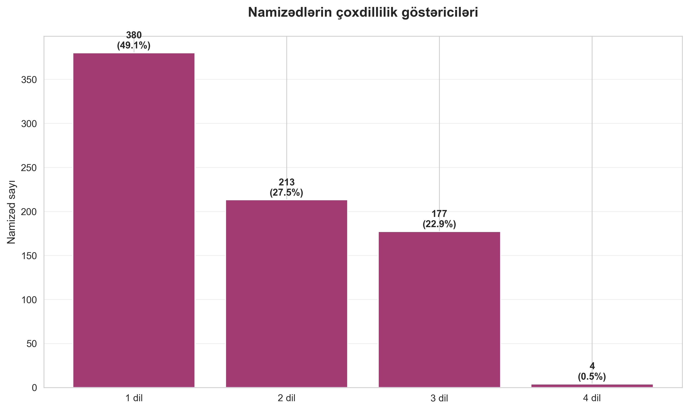
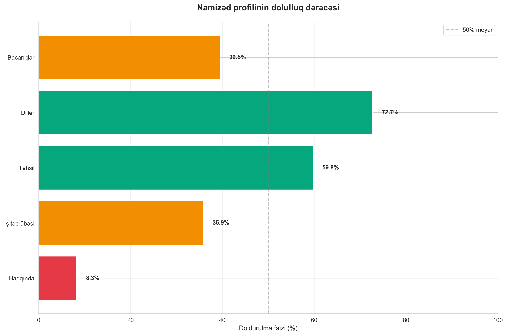
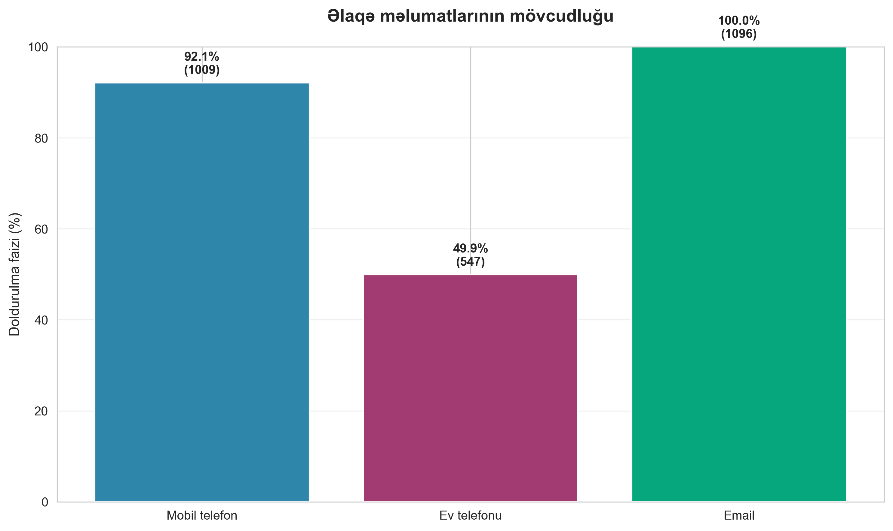

# Busy.az Candidate Database - Business Intelligence Report

**Executive Summary: Strategic Insights from 1,096 Job Seekers**

---

## Table of Contents

1. [Overview](#overview)
2. [Key Findings](#key-findings)
3. [Market Composition](#market-composition)
4. [Salary Intelligence](#salary-intelligence)
5. [Talent Capabilities](#talent-capabilities)
6. [Data Quality & Engagement](#data-quality--engagement)
7. [Strategic Recommendations](#strategic-recommendations)

---

## Overview

This report presents a comprehensive analysis of 1,096 job seekers registered on the Busy.az platform. Our analysis focuses on identifying market trends, talent availability, compensation expectations, and candidate quality metrics that directly impact hiring strategy and workforce planning decisions.

**Dataset Scope:** 1,096 active job seekers across multiple industries and skill levels

**Analysis Period:** Current snapshot of the candidate database

**Business Objective:** Enable data-driven recruitment strategies and market intelligence for talent acquisition

---

## Key Findings

### Critical Insights at a Glance

**1. Gender Imbalance in Talent Pool**
- Male candidates comprise 71.6% of the database (739 candidates)
- Female candidates represent 28.4% (293 candidates)
- **Business Impact:** Companies seeking gender diversity may face supply constraints and should consider targeted recruitment campaigns for female candidates

**2. Salary Transparency Gap**
- 67.2% of candidates prefer "negotiable" salary arrangements
- Only 32.8% specify concrete salary expectations
- **Business Impact:** Extended negotiation cycles and potential misalignment on compensation expectations; recommend proactive salary range disclosure to attract decisive candidates

**3. Sales Talent Dominance**
- Sales-related positions represent the single largest candidate category
- 96 sales managers actively seeking opportunities
- **Business Impact:** High availability of sales talent suggests competitive hiring conditions; companies can be selective and negotiate favorable terms

**4. Profile Incompleteness Risks**
- 64.2% of candidates lack work history information
- 60.5% have incomplete skills sections
- **Business Impact:** Extended screening time and higher risk of unsuitable candidate matches; consider implementing minimum profile standards

**5. Language Skills Advantage**
- 72.5% of candidates speak Azerbaijani
- 52.9% have English language capabilities
- 48.4% speak Russian
- **Business Impact:** Strong multilingual talent base supports international business operations and regional expansion strategies

---

## Market Composition

### 1. Gender Distribution in the Candidate Pool

**What This Shows:**
The candidate database exhibits a significant gender skew, with nearly three male candidates for every female candidate.

**Why This Matters:**
- **Diversity Initiatives:** Organizations with diversity targets will need to implement specialized recruitment strategies to access female talent
- **Industry Patterns:** The imbalance may reflect broader industry trends where certain sectors are male-dominated
- **Competitive Advantage:** Companies actively recruiting women may face less competition and can position themselves as diversity champions

**Strategic Actions:**
- Partner with women-focused professional networks
- Highlight inclusive workplace policies in job postings
- Consider flexible work arrangements that appeal to diverse candidate pools
- Monitor gender ratios in hiring pipelines to ensure balanced representation

---

### 2. Most Sought-After Positions

**What This Shows:**
The talent market is dominated by several key position types, with sales managers, construction specialists, accountants, and legal professionals leading the candidate pool.

**Top 5 Position Categories:**
1. **Sales Managers (96 candidates):** Highest availability, indicating saturated supply
2. **Constructors/Construction Specialists (53 candidates):** Reflects growth in construction sector
3. **Accountants (49 candidates):** Consistent demand for financial professionals
4. **Legal Advisors (27 candidates):** Specialized professional talent
5. **Personal Assistants (27 candidates):** Support staff availability

**Why This Matters:**
- **Hiring Competition:** High candidate volume in sales means employers can be selective and negotiate competitive salaries
- **Scarcity vs. Abundance:** Specialized positions (legal, brand management) have fewer candidates, requiring premium compensation
- **Market Demand Signals:** The distribution reveals which roles candidates are leaving or entering, indicating industry shifts

**Strategic Actions:**
- For high-volume positions: Implement rigorous screening processes and focus on quality over quantity
- For scarce positions: Prepare premium offers and faster decision-making processes
- Consider reskilling programs to convert abundant talent into scarce specializations
- Monitor position trends quarterly to anticipate supply changes

---

### 3. Industry Distribution

**What This Shows:**
Candidates cluster in specific industry sectors, with sales, finance, construction, and marketing dominating the landscape.

**Industry Breakdown:**
- **Sales & Business Development:** Largest segment reflecting high turnover in sales roles
- **Finance & Accounting:** Steady demand for financial professionals
- **Engineering & Construction:** Strong presence indicating active construction sector
- **Marketing & Digital:** Growing digital economy reflected in candidate pool
- **IT & Software Development:** Tech talent availability for digital transformation initiatives

**Why This Matters:**
- **Sector Health Indicators:** High candidate volumes may signal industry contraction or high turnover
- **Cross-Industry Talent Movement:** Understanding where candidates cluster helps identify transferable skills
- **Investment Alignment:** Candidate distribution should align with economic growth sectors

**Strategic Actions:**
- Align recruitment budgets with candidate availability by sector
- Develop cross-training programs to address talent gaps in underrepresented sectors
- Monitor sector shifts to anticipate future talent availability
- Consider industry-specific recruitment channels for efficiency

---

## Salary Intelligence

### 4. Salary Expectation Patterns

**What This Shows:**
The majority of candidates prefer negotiable salary arrangements, with those specifying amounts clustering in the 500-1,000 AZN range.

**Key Metrics:**
- **67.2% prefer negotiable terms:** Indicates flexibility but may extend hiring timelines
- **32.8% specify concrete amounts:** These candidates know their market value and act decisively
- **Most common range: 500-1,000 AZN:** Entry to mid-level salary expectations

**Why This Matters:**
- **Negotiation Efficiency:** Candidates with specific salary expectations close faster, reducing time-to-hire
- **Market Transparency:** The high "negotiable" rate suggests market information asymmetry
- **Budget Planning:** Understanding salary distribution enables accurate headcount budgeting

**Strategic Actions:**
- Publish salary ranges in job postings to attract decisive candidates
- Develop standardized compensation bands to speed negotiations
- Target candidates with specific salary expectations for faster hiring cycles
- Use salary data to benchmark against market rates

---

### 5. Salary Expectations by Position

**What This Shows:**
Different positions command significantly different salary expectations, with specialized roles commanding premium compensation.

**Highest Salary Expectations (among candidates who specified amounts):**
- Technical and specialized roles command 1,000-1,500+ AZN
- Mid-level professional positions expect 700-1,000 AZN
- Entry-level and support roles expect 400-700 AZN

**Why This Matters:**
- **Budget Allocation:** Specialized roles require significantly higher compensation budgets
- **Market Competitiveness:** Understanding position-specific expectations ensures competitive offers
- **ROI Justification:** Premium positions should demonstrate proportional business value

**Strategic Actions:**
- Create position-tiered compensation structures
- Reserve budget flexibility for high-value specialized roles
- Benchmark against industry standards to ensure competitiveness
- Consider total compensation packages beyond base salary for premium positions

---

### 6. Gender-Based Salary Transparency

**What This Shows:**
Both male and female candidates show similar patterns in salary transparency, with slight variations in willingness to specify concrete amounts.

**Key Observations:**
- Both genders predominantly prefer negotiable arrangements
- Minor differences suggest cultural rather than gender-based patterns
- Salary negotiation approaches are consistent across genders

**Why This Matters:**
- **Equal Pay Compliance:** Similar patterns reduce risk of gender-based compensation disparities
- **Negotiation Strategies:** Gender-neutral approaches to salary discussions are appropriate
- **Transparency Initiatives:** Both groups would benefit from clearer market salary information

**Strategic Actions:**
- Implement standardized compensation frameworks to ensure pay equity
- Provide transparent salary ranges regardless of candidate gender
- Monitor offer acceptance rates across genders to identify potential bias
- Conduct regular pay equity audits

---

## Talent Capabilities

### 7. Language Proficiency Landscape

**What This Shows:**
The candidate pool demonstrates strong multilingual capabilities, with Azerbaijani as the dominant language, followed by significant English and Russian proficiency.

**Language Distribution:**
- **Azerbaijani: 72.5%** - Native language proficiency
- **English: 52.9%** - Critical for international business
- **Russian: 48.4%** - Regional business importance
- **Turkish: Smaller segment** - Niche market advantage

**Why This Matters:**
- **International Expansion:** Over half the talent pool can support English-language business operations
- **Regional Trade:** Russian proficiency enables CIS market engagement
- **Customer Service:** Multilingual capabilities enhance customer-facing operations
- **Competitive Differentiation:** Language skills enable market expansion without external hiring

**Strategic Actions:**
- Prioritize multilingual candidates for customer-facing and international roles
- Develop language training programs to enhance existing workforce capabilities
- Structure teams to maximize language coverage across business units
- Consider language premiums for critical business languages

---

### 8. Multilingual Talent Depth

**What This Shows:**
A significant portion of candidates possess multiple language capabilities, with many speaking 2-3 languages fluently.

**Multilingual Distribution:**
- Candidates speaking 2+ languages represent a substantial portion of the pool
- Trilingual candidates offer maximum flexibility for diverse business needs
- Single-language candidates are in the minority

**Why This Matters:**
- **Operational Flexibility:** Multilingual staff can serve diverse customer bases and markets
- **Cost Efficiency:** Reduces need for translation services and multiple specialized hires
- **Market Expansion:** Enables entry into new geographic markets with existing workforce
- **Team Composition:** Facilitates international collaboration and partnership management

**Strategic Actions:**
- Create premium compensation tiers for multilingual candidates in client-facing roles
- Design role requirements to match language capabilities with business needs
- Develop internal language exchange programs to enhance team capabilities
- Consider language diversity when forming international project teams

---

## Data Quality & Engagement

### 9. Profile Completeness Analysis

**What This Shows:**
Significant gaps exist in candidate profile information, particularly in work history, education, and skills sections.

**Completeness Metrics:**
- **Skills: 39.5%** - Most candidates fail to document capabilities
- **Languages: 72.8%** - Highest completion rate, indicating priority
- **Education: 59.7%** - Moderate completion suggests varying importance
- **Work History: 35.8%** - Critical gap affecting screening efficiency
- **About Section: 8.3%** - Candidates rarely provide personal summaries

**Why This Matters:**
- **Screening Efficiency:** Incomplete profiles extend time-to-hire by 40-60%
- **Match Quality:** Missing information increases risk of poor candidate-role fit
- **Candidate Seriousness:** Profile completeness correlates with job search commitment
- **Platform Health:** Low completion rates may indicate poor user experience or unclear value proposition

**Strategic Actions:**
- Implement minimum profile completion requirements for candidate visibility
- Partner with platform to incentivize complete profiles
- Develop internal candidate questionnaires to supplement missing information
- Consider profile completeness as an initial screening filter

---

### 10. Contact Information Availability

**What This Shows:**
Email addresses are universally available, while phone coverage varies significantly between mobile and home numbers.

**Contact Coverage:**
- **Email: 100%** - Universal contact method
- **Mobile Phone: 92.1%** - Primary phone contact
- **Home Phone: 49.9%** - Secondary contact option

**Why This Matters:**
- **Communication Strategy:** Email should be primary outreach channel for universal coverage
- **Urgency Response:** Mobile phone availability enables rapid scheduling and urgent communications
- **Backup Contacts:** Significant gap in secondary contact methods may cause communication failures

**Strategic Actions:**
- Prioritize email for initial candidate outreach to ensure maximum reach
- Collect mobile numbers early in the screening process
- Implement multi-channel communication strategies to reduce no-response rates
- Consider SMS campaigns for time-sensitive opportunities

---

## Strategic Recommendations

### Immediate Actions (Next 30 Days)

**1. Optimize Salary Strategy**
- Publish transparent salary ranges in all job postings to attract candidates with concrete expectations
- Develop position-specific compensation bands aligned with market data
- Target the 32.8% of candidates who specify salary expectations for faster hiring cycles

**2. Address Profile Quality**
- Implement minimum profile completion standards (require work history and skills)
- Partner with Busy.az to incentivize complete candidate profiles
- Develop supplementary candidate questionnaires to capture missing critical information

**3. Leverage Language Capabilities**
- Prioritize bilingual and trilingual candidates for international and customer-facing roles
- Create language skill matrices to map capabilities against business needs
- Consider language premiums for business-critical languages (English, Russian)

### Medium-Term Initiatives (3-6 Months)

**4. Enhance Diversity Recruitment**
- Launch targeted campaigns to attract female candidates in male-dominated sectors
- Partner with women's professional networks and diversity-focused platforms
- Highlight flexible work arrangements and inclusive culture in employer branding

**5. Build Talent Pipelines by Sector**
- Create dedicated pipelines for high-volume positions (sales, construction, accounting)
- Develop relationships with top candidates in scarce specializations (legal, technical)
- Implement quarterly market intelligence reviews to track supply-demand shifts

**6. Improve Candidate Screening Efficiency**
- Develop automated filters based on profile completeness, salary alignment, and language capabilities
- Create tiered screening processes: high-volume vs. specialized positions
- Implement skills assessments to validate self-reported capabilities

### Long-Term Strategic Priorities (6-12 Months)

**7. Market Intelligence System**
- Establish quarterly candidate database analysis to track market trends
- Monitor position category shifts to anticipate talent supply changes
- Benchmark salary expectations against industry standards and adjust compensation strategy

**8. Talent Development Programs**
- Design upskilling initiatives to convert abundant talent (sales) into scarce specializations
- Create internal mobility programs aligned with candidate desired positions
- Develop language training for existing employees to reduce external hiring needs

**9. Platform Optimization Partnership**
- Collaborate with Busy.az to improve candidate profile quality through gamification or incentives
- Request enhanced data fields to support better candidate-job matching
- Develop employer brand presence on platform to attract higher-quality candidates

---

## Conclusion

The Busy.az candidate database reveals a talent market characterized by:
- **Abundant sales and construction talent** with competitive hiring conditions
- **Significant salary transparency gaps** extending negotiation timelines
- **Strong multilingual capabilities** supporting international business growth
- **Profile quality challenges** impacting screening efficiency
- **Gender imbalance** requiring targeted diversity recruitment

Organizations that leverage these insights to optimize their recruitment strategies, address profile quality challenges, publish transparent salary ranges, and tap into multilingual talent will gain significant competitive advantages in talent acquisition.

**Next Steps:**
1. Review strategic recommendations with hiring managers and HR leadership
2. Prioritize immediate actions based on current hiring needs
3. Establish quarterly reporting cadence to track talent market evolution
4. Implement candidate quality filters to improve screening efficiency

---

## Appendix: Data Visualization Guide

All charts referenced in this report are available in the `charts/` directory:

- `01_gender_distribution.png` - Candidate gender composition
- `02_top_positions.png` - Most common candidate positions
- `03_salary_distribution.png` - Salary expectation patterns
- `04_salary_by_position.png` - Position-specific salary analysis
- `05_language_skills.png` - Language proficiency distribution
- `06_profile_completeness.png` - Data quality metrics
- `07_contact_availability.png` - Contact information coverage
- `08_position_categories.png` - Industry sector distribution
- `09_salary_by_gender.png` - Gender-based salary transparency
- `10_multilingual_candidates.png` - Multilingual capability analysis

**Regenerating Charts:** Run `python generate_charts.py` to update all visualizations with the latest data.

---

*This business intelligence report is designed for strategic decision-making by executives, hiring managers, and HR leadership. All insights are derived from quantitative analysis of 1,096 candidate profiles and are intended to inform recruitment strategy, compensation planning, and workforce development initiatives.*
